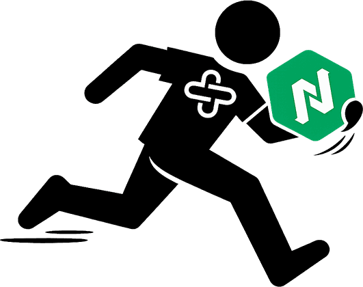

## Alex Freidah

Infrastructure & Platform Engineering · [website](https://alexfreidah.com) 

---

### Homelab (munchbox - named after my dog Munch) and projects that spun out of it

<table>
<tr>
<td width="80" align="center"></td>
<td><strong><a href="https://github.com/afreidah/munchbox">munchbox</a></strong>       Hybrid-cloud homelab running Nomad, Consul, and Vault across bare metal, Proxmox VMs, and Oracle Cloud free-tier nodes linked over WireGuard. The other projects spun out of it.</td>
</tr>
<tr>
<td width="80" align="center"></td>
<td><strong><a href="https://s3-orchestrator.munchbox.cc">s3-orchestrator</a></strong>  Presents many S3-compatible providers as one S3 endpoint, with replicated copies, read failover, per-backend limits, compression, and envelope encryption.</td>
</tr>
<tr>
<td width="80" align="center"></td>
<td><strong><a href="https://vagabond.munchbox.cc">vagabond</a></strong>  Compute broker for short-lived workloads: describe a job once in Nomad-style HCL and it runs on Cloud Run, Lambda, or your own machines.</td>
</tr>
<tr>
<td width="80" align="center"></td>
<td><strong><a href="https://nomad-temporal-jobs.munchbox.cc">nomad-temporal-jobs</a></strong> Temporal workers that automate Nomad/Consul cluster ops: S3 backups, Trivy scans, orphaned-data cleanup, and registry GC, traced with OpenTelemetry.</td>
</tr>
<tr>
<td width="80" align="center"></td>
<td><strong><a href="https://g3.munchbox.cc">g3</a></strong> S3-compatible gateway that stores objects as Gmail messages, turning 15 GB of free mail storage into an offsite backup target.</td>
</tr>
<tr>
<td width="80" align="center"></td>
<td><strong><a href="https://github.com/afreidah/munchbox-hashi-upgrade">munchbox-hashi-upgrade</a></strong> Resumable rolling upgrades for Nomad, Consul, and Vault, with task order and health gates derived from the cluster itself.</td>
</tr>
<tr>
<td width="80" align="center"></td>
<td><strong><a href="https://cloudflare-log-collector.munchbox.cc">cloudflare-log-collector</a></strong> Polls Cloudflare's GraphQL API for firewall events and traffic stats and ships them to Loki and Prometheus.</td>
</tr>
<tr>
<td width="80" align="center"></td>
<td><strong><a href="https://oracle-watchdog.munchbox.cc">oracle-watchdog</a></strong> Auto-recovers stuck Oracle Cloud free-tier instances by watching Consul session heartbeats and driving OCI stop/start cycles.</td>
</tr>
</table>
